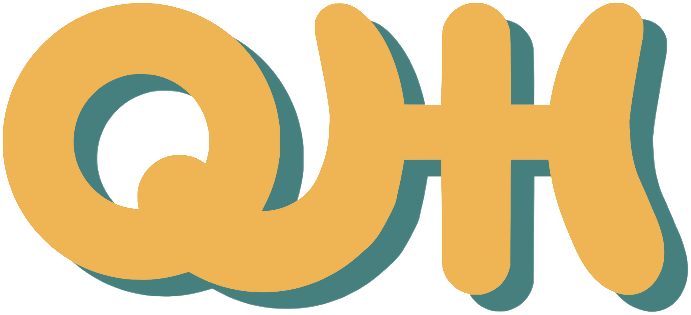
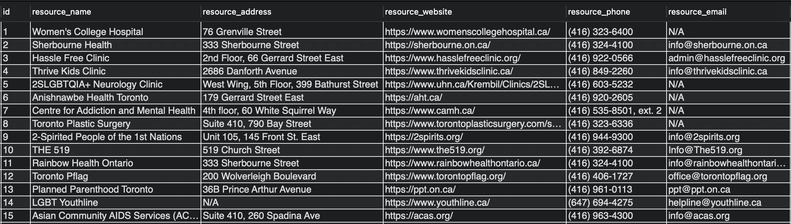
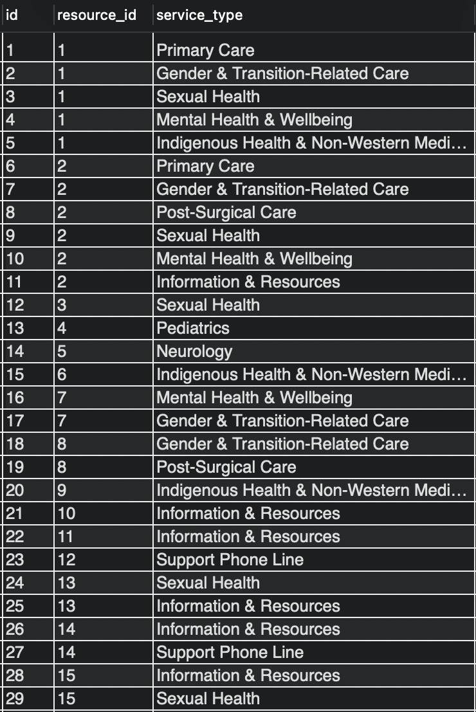

# Project Title
**Queer Health Hub (QHH)**





## Overview
Queer Health Hub is a local resource for 2SLGBTQIA++ people in the City of Toronto that aims to increase access to information, resources, and healthcare service providers.


Client Repo can be found [here](https://github.com/carlywilk/capstone.git)


## Features
Deployed website can be found [here]() ❗️ add link


## Screenshots
The following two screenshots show the dynamic data for this app in MySQL, the first being a table of resources and the second being a list of services offered at each resource. 

Image 1: Screenshot of resources data in MySQL table.



Image 2: Screenshot of services data in MySQL table.



## Instructions & Installation


### Tech Stack
**Server:**
- express
- nodemon
- cors
- knex
- mysql2
- dotenv


### Environment Variables
To run this project, you will need to add the following environment variables to your server-side .env file:
```
PORT=
DB_HOST=
DB_NAME=
DB_USER=
DB_PASSWORD=
```


### Run Locally 
1. Clone the project repositories:
```
git clone https://github.com/carlywilk/capstone-api.git
```

2. Go to the project directory:
```
cd carly-wilk-capstone-api
```

3. Install dependencies:
```
npm install
```

4. Start the servers:
```
npm start
```


## API Reference
#### Get all resources
```
  GET /api/resources
```
| Parameter | Type     | Description                |
| :-------- | :------- | :------------------------- |
| `api_key` | `string` | **Required**. Your API key |

#### Get one resource
```
  GET /api/resources/${id}
```
| Parameter | Type     | Description                                  |
| :-------- | :------- | :------------------------------------------- |
| `api_key` | `string` | **Required:** Your API key & ID of resource  |

#### Get all services types for one resource
```
  GET /api/resources/${id}/services
```
| Parameter | Type     | Description                                  |
| :-------- | :------- | :------------------------------------------- |
| `api_key` | `string` | **Required:** Your API key & ID of resource  |


## Insights and Lessons Learned


## Next Steps and Future Directions
Ideally this app would be constantly growing, adding new resources and information for the city of Toronto, with the option of expanding geographically.

Some additional features I would like to add to this app include: 
- Search and filter option by services offered
  - On the list view page and eventually a site-wide search option
- Add the ability for the user to create a profile and ineract with the site such as:
  - Save bookmarks
  - Add home location and determine directions / distance to resource
  - Add option to rate and / or review resources
- Add additional information on the resources including:
  - Resource accessibility
  - Transit access for the resource
